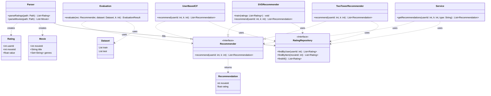

```mermaid
classDiagram
    class Recommendation {
        int movieId
        float rating
    }

    class Movie {
        +int movieId
        +String title
        +Set~String~ genres
    }

    class Rating {
        +int userId
        +int movieId
        +float value
    }

    class Dataset {
        List<Rating> train
        List<Rating> test
    }

    class Recommender {
        <<Interface>>
        +recommend(userId: int, k: int) List~Recommendation~
    }
    
    class RatingRepository {
        <<Interface>>
        +findByUser(userId: int) List~Rating~
        +findByItem(movieId: int) List~Rating~
        +findAll() List~Rating~
    }

    class UserBasedCF {
        +recommend(userId: int, k: int) List~Recommendation~
    }
    
    class SVDRecommender {
        +train(ratings: List~Rating~) void
        +recommend(userId: int, k: int) List~Recommendation~
    }
    
    class TwoTowerRecommender {
        +recommend(userId: int, k: int) List~Recommendation~
    }

    class Parser {
        +parseRatings(path: Path) List~Rating~
        +parseMovies(path: Path) List~Movie~
    }

    class Evaluation {
        +evaluate(rec: Recommender, dataset: Dataset, k: int) EvaluationResult
    }

    class Service {
        +getRecommendations(userId: int, k: int, type: String) List~Recommendation~
    }

    
    UserBasedCF ..|> Recommender
    SVDRecommender ..|> Recommender
    TwoTowerRecommender ..|> Recommender

    Parser ..> Rating : creates
    Parser ..> Movie : creates
    
    Parser --> RatingRepository : fills

    UserBasedCF ..> RatingRepository : uses
    SVDRecommender ..> RatingRepository : uses
    TwoTowerRecommender ..> RatingRepository : uses

    Evaluation ..> Recommender : uses

    Service ..> Recommender : uses
    Service ..> RatingRepository : uses
    Evaluation ..> Dataset: uses
    Recommender ..> Recommendation: returns
```